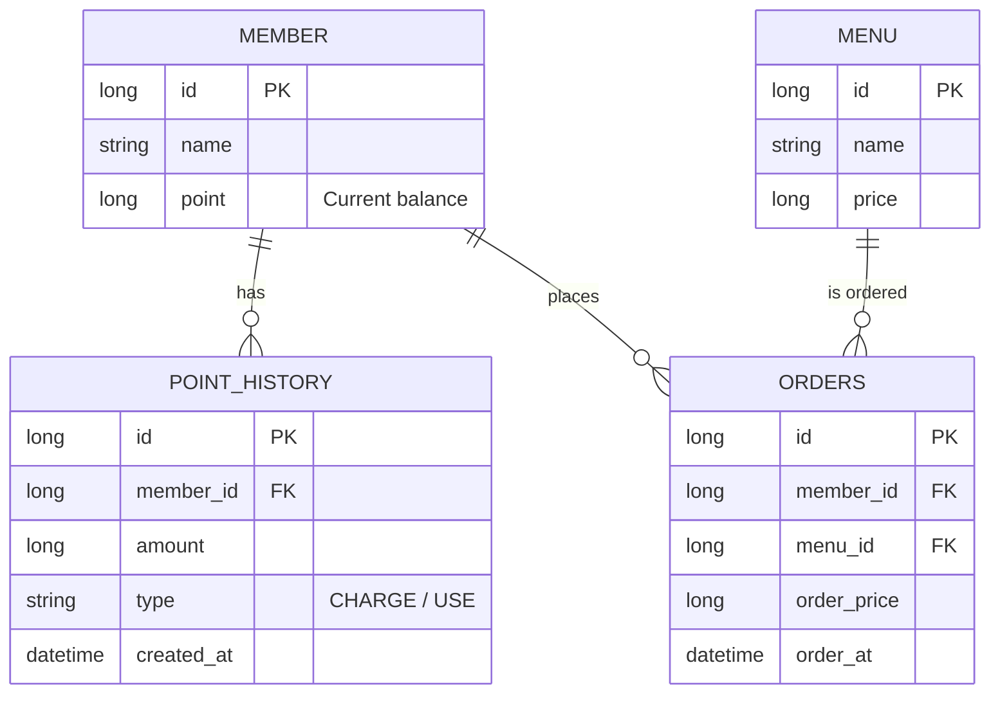

# Coffee Order API Project

## 0. 문제 해결 전략 수립

### 설계의 의도 및 전략
본 프로젝트는 커피 주문 시스템의 핵심 기능을 제공하며, 특히 **동시성 제어**와 **데이터 일관성**에 중점을 두어 설계되었습니다.

#### 1. 동시성 제어 (Point 충전 및 차감)
- 사용자의 포인트는 현금과 동일한 가치를 가지므로 정확한 잔액 관리가 필수적입니다.
- 동일 사용자가 여러 기기에서 동시에 충전 또는 주문을 요청할 경우 Race Condition이 발생할 수 있습니다.
- 이를 해결하기 위해 **비관적 락(Pessimistic Lock, `SELECT FOR UPDATE`)**을 사용합니다. 포인트 작업은 DB 수준에서 락을 획득하여 순차적으로 처리되도록 보장함으로써 데이터 정합성을 유지합니다.

#### 2. 데이터 일관성 및 확장성 (실시간 데이터 전송)
- 주문 완료 시 외부 데이터 수집 플랫폼으로 정보를 전송하는 요구사항이 있습니다.
- 외부 API 호출은 네트워크 지연이나 실패 가능성이 높습니다. 주문 로직 내에서 이를 동기적으로 처리하면 응답 속도가 저하되고, 외부 플랫폼의 장애가 주문 장애로 이어질 수 있습니다.
- **ApplicationEventPublisher**를 활용하여 주문 로직과 데이터 전송 로직을 분리(Decoupling)합니다. 추후 메시지 큐(Kafka, RabbitMQ) 등으로 확장하기 용이한 구조를 지향합니다.

#### 3. 인기 메뉴 조회 (정확성 및 성능)
- 최근 7일간의 데이터를 기준으로 집계합니다.
- `Order` 테이블의 `order_at`과 `menu_id`에 인덱스를 구성하여 집계 쿼리의 성능을 최적화합니다.
- 요구사항에서 "정확해야 함"을 강조했으므로, 실시간 집계 쿼리를 기본으로 하되 트래픽 증가 시 Redis 등을 활용한 캐싱 전략을 고려할 수 있습니다.

### 기술적 선택 이유
- **Spring Data JPA**: 객체 지향적인 데이터 접근과 선언적 트랜잭션 관리를 위해 사용합니다.
- **H2 Database**: 별도의 설치 없이 실행 가능하며 요구사항에 명시된 내장 DB로 사용합니다.
- **Pessimistic Lock**: 포인트와 같은 민감한 데이터의 정합성을 위해 충돌 가능성을 전제로 한 안전한 잠금 방식을 선택했습니다.

---

## 설계 내용

### ERD


### API 명세서

| 기능 | Method | Path | Request | Response |
| :--- | :--- | :--- | :--- | :--- |
| 메뉴 목록 조회 | GET | `/api/v1/menus` | - | `List<MenuResponse>` |
| 포인트 충전 | POST | `/api/v1/points/charge` | `{memberId, amount}` | `PointResponse` |
| 주문 및 결제 | POST | `/api/v1/orders` | `{memberId, menuId}` | `OrderResponse` |
| 인기 메뉴 조회 | GET | `/api/v1/menus/popular` | - | `List<PopularMenuResponse>` |

---

## 구현 단계
1. 도메인 엔티티 및 리포지토리 구현
2. 포인트 충전 및 조회 기능 구현 (Lock 적용)
3. 주문/결제 및 이벤트 기반 데이터 전송 구현
4. 통계 쿼리를 통한 인기 메뉴 조회 구현
5. 통합 테스트를 통한 동시성 및 기능 검증

---

## 실행 및 테스트 방법

### 1. 애플리케이션 실행
```bash
./gradlew bootRun
```
애플리케이션이 실행되면 `DataInitializer`에 의해 초기 데이터(메뉴, 테스트 사용자)가 자동으로 삽입됩니다.

### 2. API 호출 예시

#### 메뉴 목록 조회
```bash
GET http://localhost:8080/api/v1/menus
```

#### 포인트 충전
```bash
POST http://localhost:8080/api/v1/points/charge
Content-Type: application/json

{
    "memberId": 1,
    "amount": 10000
}
```

#### 주문 및 결제
```bash
POST http://localhost:8080/api/v1/orders
Content-Type: application/json

{
    "memberId": 1,
    "menuId": 1
}
```

#### 인기 메뉴 조회 (최근 7일)
```bash
GET http://localhost:8080/api/v1/menus/popular
```
